# FlutterFeedbackDialog

A customizable and easy-to-use Flutter package for collecting user feedback through beautiful dialog popups. Supports text input, image attachments, and integrates seamlessly with the **free** [FeedbackNest](https://feedbacknest.app) AI-powered backend that automatically organizes feedback with smart tags, sentiment analysis, and priority detection.

<div align="center">

[](https://pub.dev/packages/flutter_feedback_dialog)
[](https://opensource.org/licenses/MIT)

</div>

# MyApp - Auto Rating System

A smart rating system that maximizes positive app store reviews while collecting valuable user feedback.

## Features
- Session-based rating prompts
- Intelligent user flow based on rating scores
- Comprehensive feedback collection
- Dynamic prompt frequency adjustment

## Auto Rating Flow

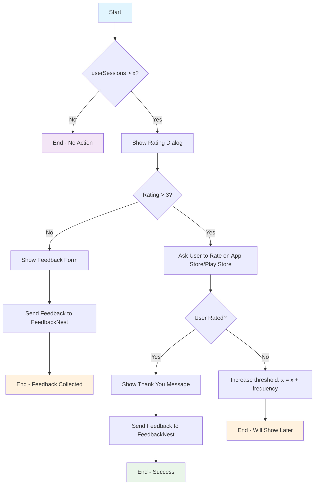

## 📋 Table of Contents

- [Features](#-features)
- [Screenshots](#-screenshots)
- [Quick Start](#-quick-start)
- [Step-by-Step Setup](#-step-by-step-setup)
- [Usage Examples](#-usage-examples)
- [FeedbackNest Integration](#-feedbacknest-integration)
- [Customization](#-customization)
- [Example App](#-example-app)
- [Contributing](#-contributing)

## ✨ Features

- **🎯 Multiple Feedback Types**: Feedback, bug reports, feature requests, and contact forms
- **🎨 Dual Themes**: Beautiful light and dark theme support
- **📸 Image Attachments**: Users can attach screenshots or images
- **🔧 Fully Customizable**: Titles, subtitles, buttons, icons, colors, and more
- **⚡ Simple Integration**: Show dialogs with a single function call
- **✅ Built-in Validation**: Form validation for required fields
- **🔄 Success Messages**: Custom success notifications
- **🤖 AI-Powered Backend**: Free FeedbackNest integration with automatic categorization, sentiment analysis, and smart prioritization
- **📊 Project Management**: Track feedback progress from Open → In Progress → Done

## 📸 Screenshots

### Light Theme Dialogs
| Feedback | Bug Report | Feature Request | Contact |
|----------|------------|-----------------|---------|
| 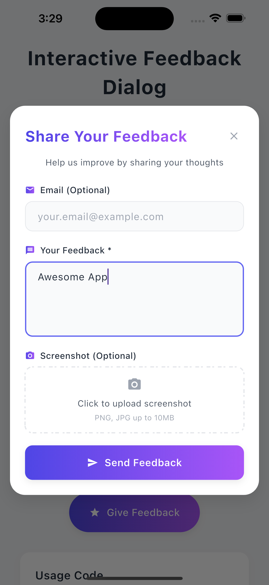<br/>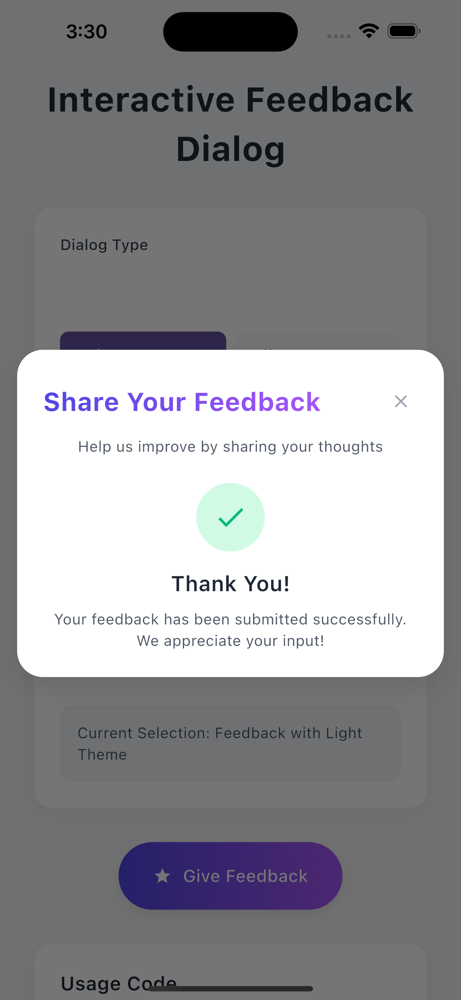 | 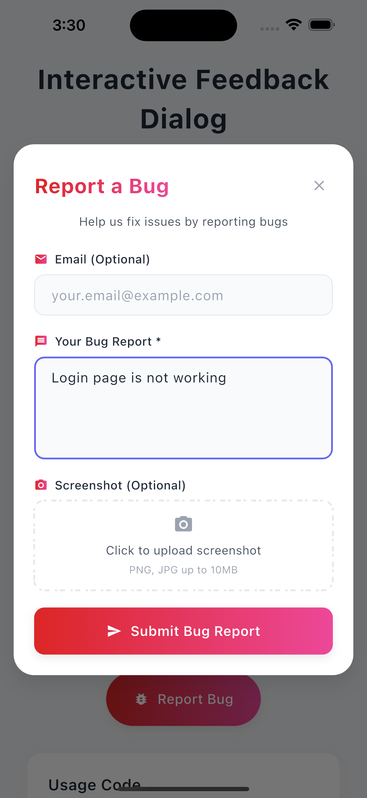<br/>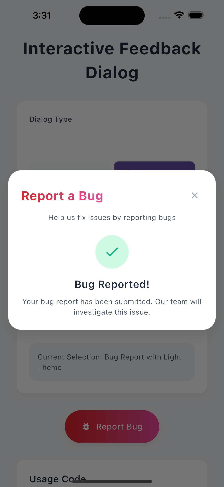 | 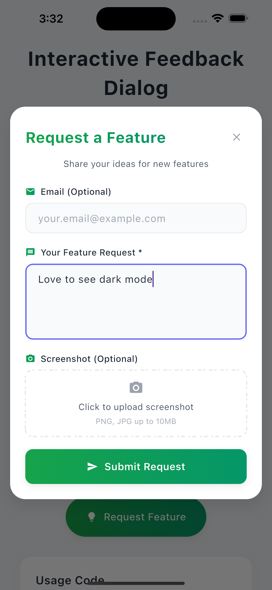<br/>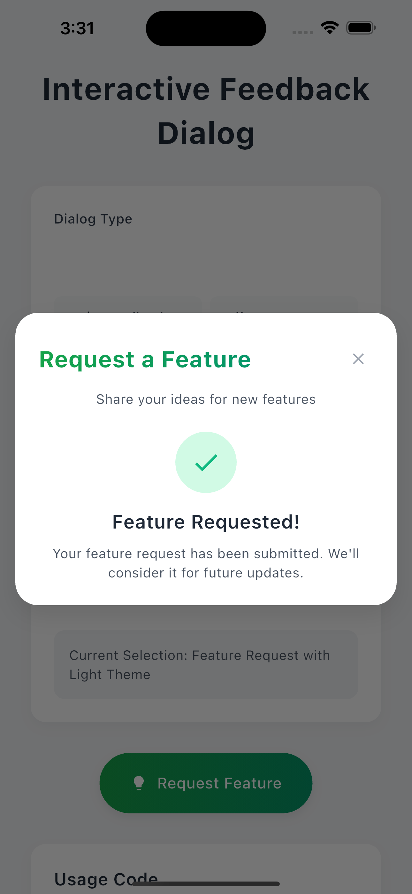 | 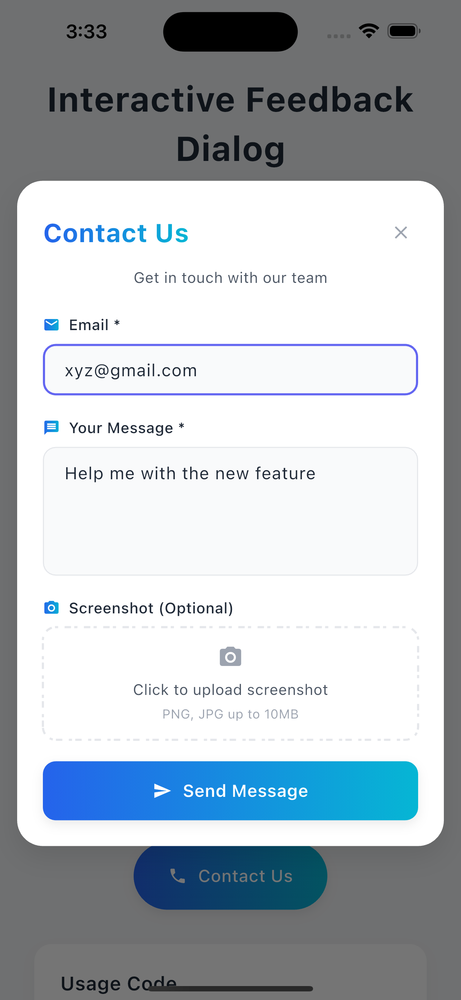<br/>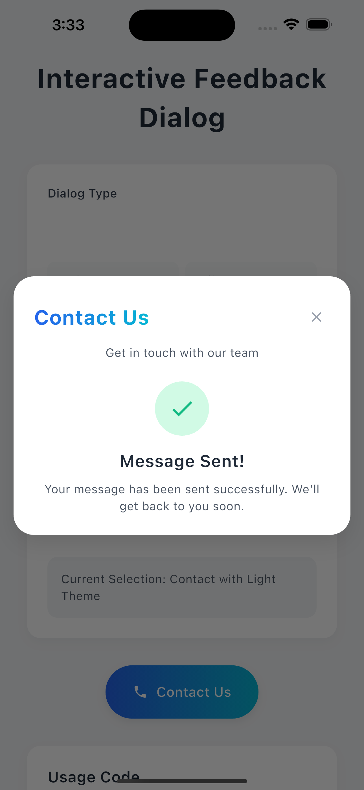 |

### Dark Theme Dialogs
| Feedback | Bug Report | Feature Request | Contact |
|----------|------------|-----------------|---------|
| 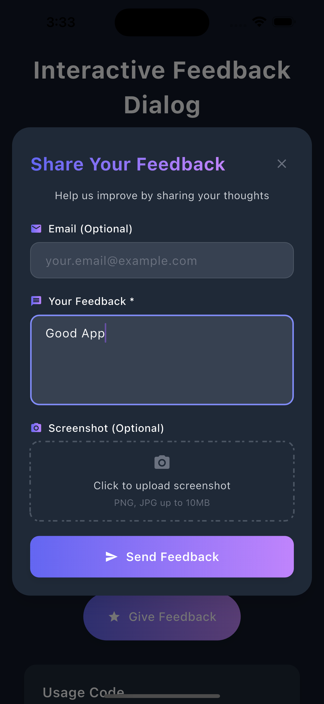 | 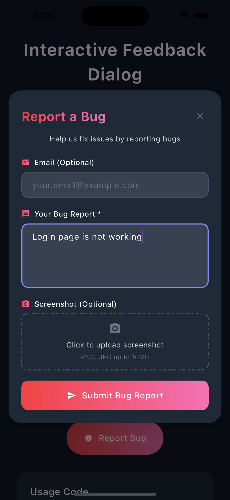 | 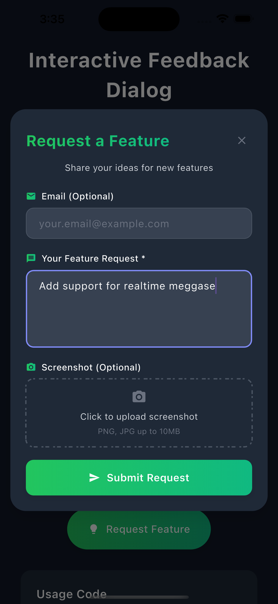 | 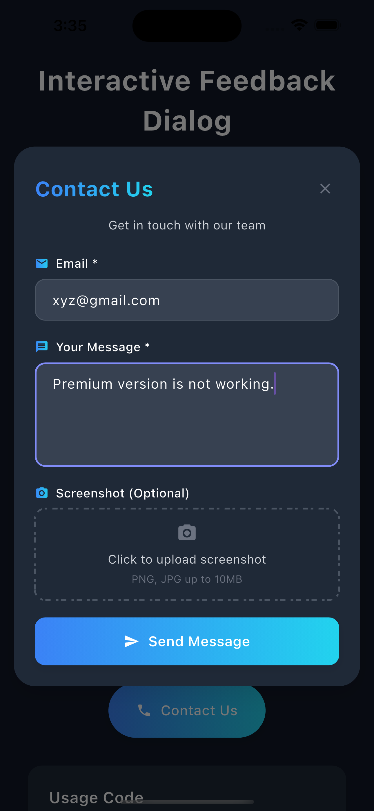 |

## 🚀 Quick Start

### 1. Add Dependencies

```yaml
dependencies:
  flutter_feedback_dialog: any
  feedbacknest_core: any  # Optional: for free backend integration
```

### 2. Import Package

```dart
import 'package:flutter_feedback_dialog/flutter_feedback_dialog.dart';
```

### 3. Show Dialog

```dart
FlutterFeedbackDialog.show(
  context,
  type: CommunicationViewType.feedback,
  theme: CommunicationTheme.light,
  onSubmit: (response) {
    print('Feedback: ${response.message}');
  },
);
```

## 📖 Step-by-Step Setup

### Step 1: Installation

Run this command in your Flutter project:

```bash
flutter pub add flutter_feedback_dialog
```

### Step 2: Import the Package

Add the import statement to your Dart file:

```dart
import 'package:flutter_feedback_dialog/flutter_feedback_dialog.dart';
```

### Step 3: Basic Implementation

Add a button to trigger the feedback dialog:

```dart
ElevatedButton(
  onPressed: () {
    FlutterFeedbackDialog.show(
      context,
      type: CommunicationViewType.feedback,
      theme: CommunicationTheme.light,
      onSubmit: (CommunicationResponse response) {
        // Handle the response
        print('Message: ${response.message}');
        print('Email: ${response.email}');
        print('Screenshots: ${response.screenshots?.length ?? 0}');
      },
    );
  },
  child: Text('Give Feedback'),
)
```

### Step 4: Handle Different Feedback Types

```dart
// Feedback Dialog
FlutterFeedbackDialog.show(context, type: CommunicationViewType.feedback);

// Bug Report Dialog
FlutterFeedbackDialog.show(context, type: CommunicationViewType.bug);

// Feature Request Dialog
FlutterFeedbackDialog.show(context, type: CommunicationViewType.featureRequest);

// Contact Dialog
FlutterFeedbackDialog.show(context, type: CommunicationViewType.contact);
```

## 💻 Usage Examples

### Basic Usage

```dart
FlutterFeedbackDialog.show(
  context,
  type: CommunicationViewType.feedback,
  theme: CommunicationTheme.light,
  onSubmit: (CommunicationResponse response) {
    // Process the feedback
    print('User feedback: ${response.message}');
    print('User email: ${response.email}');
    
    // Handle image attachments
    if (response.screenshots != null && response.screenshots!.isNotEmpty) {
      print('User attached ${response.screenshots!.length} images');
    }
  },
);
```

### Advanced Customization

```dart
FlutterFeedbackDialog.show(
  context,
  type: CommunicationViewType.bug,
  theme: CommunicationTheme.dark,
  title: "🐛 Report a Bug",
  subtitle: "Help us squash bugs and improve the app!",
  buttonText: "Submit Bug Report",
  placeholder: "Please describe the bug you encountered...",
  icon: Icons.bug_report,
  successMessage: "Thanks! We'll investigate this bug soon.",
  onSubmit: (CommunicationResponse response) {
    // Handle bug report
    _processBugReport(response);
  },
);
```

## ☁️ FeedbackNest Integration

**FeedbackNest is completely FREE** and provides an intelligent backend solution for collecting and managing feedback without any setup complexity. It uses **AI to automatically analyze and organize** all user communications.

### 🤖 AI-Powered Features

FeedbackNest automatically uses AI to enhance your feedback management:

- **🎯 Auto-Generated Titles** - AI creates meaningful titles from user messages
- **🏷️ Smart Tags** - Automatically categorizes feedback with relevant tags
- **😊 Sentiment Analysis** - Detects user emotions (positive, negative, neutral)
- **📊 Priority Detection** - AI assigns priority levels based on content urgency
- **🔍 Smart Search** - Find feedback quickly with AI-enhanced search
- **📈 Trend Analysis** - Identify patterns and common issues automatically
- **👥 User Analytics** - Track total users, active sessions, new user growth
- **🗺️ Geographic Insights** - Monitor user distribution across countries
- **📱 Version Tracking** - Analyze user behavior across different app versions
- **⭐ Rating Analytics** - Monitor user satisfaction and app ratings

### Why Use FeedbackNest?

- ✅ **100% Free** - No cost, no limits, no credit card required
- ✅ **AI-Powered** - Automatic categorization, sentiment analysis, and prioritization
- ✅ **Zero Backend Setup** - No server configuration needed  
- ✅ **Smart Dashboard** - AI-organized feedback with actionable insights
- ✅ **User Analytics** - Comprehensive user tracking, session data, and geographic insights
- ✅ **Project Management** - Move feedback through stages: Open → In Progress → Done
- ✅ **Team Collaboration** - Share feedback and track progress with your team
- ✅ **Easy Integration** - Just add your API key and start collecting feedback

### Step-by-Step FeedbackNest Setup

#### Step 1: Sign Up (Free)

1. Visit [FeedbackNest.app](https://feedbacknest.app)
2. Create your free account
3. No credit card required!

#### Step 2: Create a Project

1. Click "Create New Project" in your dashboard
2. Enter your app/project name
3. Get your unique API key

<!-- Space for FeedbackNest dashboard screenshots -->
### FeedbackNest Dashboard Screenshots

#### 📊 User Insights & Analytics Dashboard
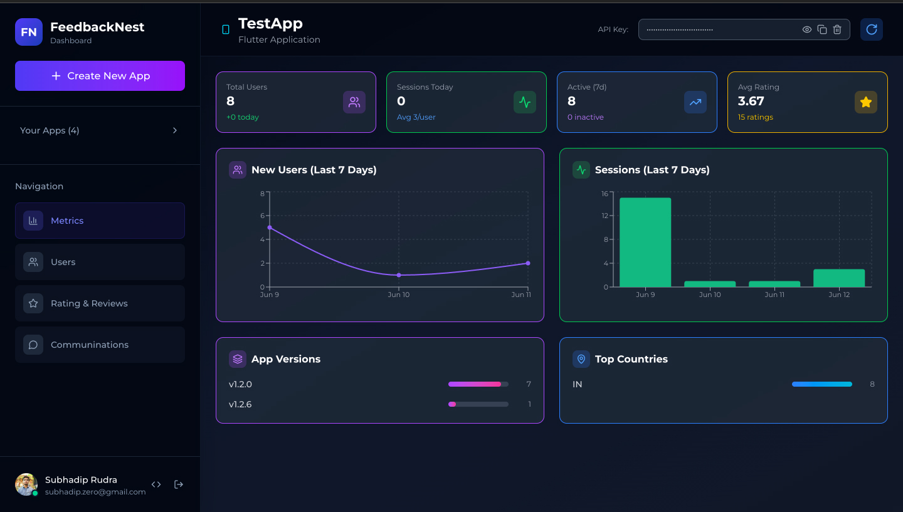

**Comprehensive User Analytics:**
- **👥 Total Users**: Track your total user base
- **📈 Sessions Today**: Monitor daily active sessions
- **🆕 New Users**: See daily user growth
- **📊 Active Users**: Track 7-day active users
- **⭐ User Ratings**: Monitor app satisfaction
- **📈 Historical Trends**: View user growth patterns over time with interactive charts
- **🗺️ Geographic Insights**: See user distribution by country
- **📱 Version Analytics**: Track users across different app versions
- **💤 Inactive Users**: Monitor user retention and engagement
- **📊 Session Patterns**: Analyze user behavior with detailed session data

#### 🏷️ Individual Feedback with AI Analysis
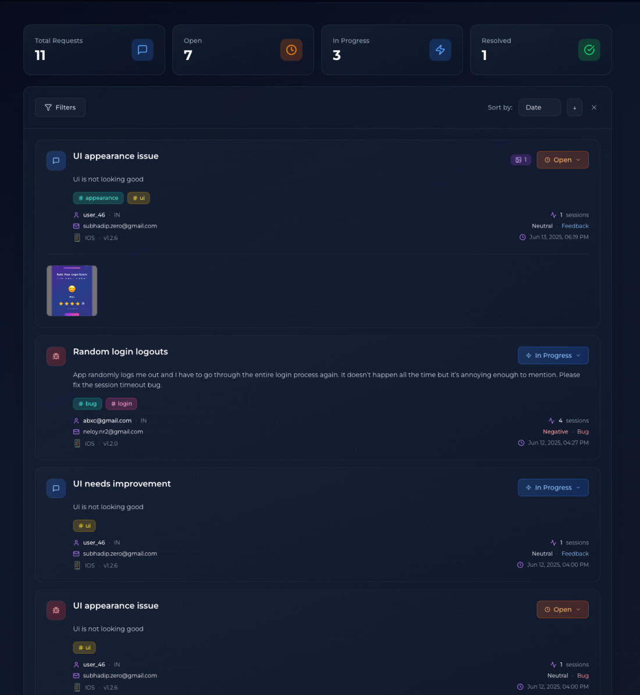

**AI-Enhanced Feedback Details:**
- **🎯 Auto-Generated Titles**: AI creates meaningful titles like "UI appearance issue", "Random login logouts"
- **🏷️ Smart Categorization**: Automatic tags based on content analysis
- **😊 Sentiment Detection**: Real-time sentiment analysis of user emotions
- **📊 Priority Assignment**: AI determines urgency and importance
- **👥 User Context**: Complete user information and communication history
- **🔄 Workflow Management**: Track progress from submission to resolution

#### Step 3: Add FeedbackNest to Your App

Add the dependency:

```yaml
dependencies:
  flutter_feedback_dialog: any
  feedbacknest_core: any
```

#### Step 4: Initialize FeedbackNest

```dart
import 'package:feedbacknest_core/feedbacknest.dart';

void main() {
  runApp(MyApp());
  
  // Initialize FeedbackNest with your free API key
  Feedbacknest.init(
    "your-api-key-from-dashboard",
    userIdentifier: "user@example.com", // Optional: identify users
  );
}
```

#### Step 5: Send Feedback to FeedbackNest

```dart
FlutterFeedbackDialog.show(
  context,
  type: CommunicationViewType.feedback,
  onSubmit: (CommunicationResponse response) async {
    Feedbacknest.sendFeedback(
        message: response.message,
        email: response.email,
        screenshots: response.screenshots,
        type: 'feedback', // 'bug', 'feature', 'contact'
      );
  },
);
```

#### Step 6: Manage Feedback with AI Dashboard

1. **View AI-Organized Feedback**: Log into your FeedbackNest dashboard to see all feedback automatically categorized with AI-generated tags and sentiment analysis
2. **Track Progress**: Move feedback through workflow stages:
   - **Open** 📋 - New feedback items
   - **In Progress** 🔄 - Items you're actively working on  
   - **Resolved** ✅ - Completed feedback items
3. **Leverage AI Insights**: Use automatic priority detection and sentiment analysis to prioritize important issues
4. **Team Collaboration**: Share feedback with your team and track who's working on what
5. **Analytics & Trends**: Monitor feedback patterns, user satisfaction, and resolution times

## 🎨 Customization

### Available Customization Options

| Parameter | Type | Description |
|-----------|------|-------------|
| `type` | `CommunicationViewType` | Dialog type: feedback, bug, featureRequest, contact |
| `theme` | `CommunicationTheme` | Theme: light or dark |
| `title` | `String?` | Custom dialog title |
| `subtitle` | `String?` | Custom dialog subtitle |
| `buttonText` | `String?` | Custom submit button text |
| `icon` | `IconData?` | Custom dialog icon |
| `placeholder` | `String?` | Custom textarea placeholder |
| `successMessage` | `String?` | Custom success message |

### Customization Examples

```dart
// Feature Request with Custom Styling
FlutterFeedbackDialog.show(
  context,
  type: CommunicationViewType.featureRequest,
  theme: CommunicationTheme.light,
  title: "💡 Got an Idea?",
  subtitle: "Share your feature ideas to help us improve!",
  buttonText: "Submit Idea",
  icon: Icons.lightbulb_outline,
  placeholder: "Describe your feature idea in detail...",
  successMessage: "🎉 Thanks! We love hearing new ideas from our users.",
  onSubmit: (response) => _handleFeatureRequest(response),
);

// Contact Form with Professional Look
FlutterFeedbackDialog.show(
  context,
  type: CommunicationViewType.contact,
  theme: CommunicationTheme.dark,
  title: "📞 Get in Touch",
  subtitle: "We'd love to hear from you!",
  buttonText: "Send Message",
  icon: Icons.contact_support,
  placeholder: "How can we help you today?",
  successMessage: "✅ Message sent! We'll get back to you soon.",
  onSubmit: (response) => _handleContactForm(response),
);
```

## 📱 Example App

Explore the complete example app in the [`example/`](example/) directory:

### What's Included:
- ✅ All dialog types (feedback, bug, feature, contact)
- ✅ Theme switching (light/dark)
- ✅ FeedbackNest integration
- ✅ Custom styling examples
- ✅ Error handling
- ✅ Success notifications

### Running the Example:

```bash
cd example
flutter pub get
flutter run
```

### Example App Features:
- **Interactive Demo**: Try all dialog types and themes
- **FeedbackNest Integration**: See real backend integration
- **Custom Styling**: Examples of dialog customization
- **Best Practices**: Proper error handling and user feedback

## 🤝 Contributing

We welcome contributions! Here's how you can help:

### Ways to Contribute:
- 🐛 **Report bugs** - Found an issue? Let us know!
- 💡 **Suggest features** - Have ideas for improvements?
- 📖 **Improve docs** - Help make our documentation better
- 🔧 **Submit PRs** - Fix bugs or add new features
- ⭐ **Star the repo** - Show your support!

### Development Setup:
```bash
git clone <repository-url>
cd flutter_feedback_dialog
flutter pub get
cd example
flutter pub get
flutter run
```

## 📄 License

This project is licensed under the MIT License - see the [LICENSE](LICENSE) file for details.

## 🆘 Support

- **Documentation**: Check our [API documentation](link-to-docs)
- **Issues**: Report bugs on [GitHub Issues](link-to-issues)
- **Discussions**: Join our [GitHub Discussions](link-to-discussions)
- **FeedbackNest Support**: Visit [FeedbackNest Help](https://feedbacknest.app/help)

---

<div align="center">

**Build better feedback experiences with FlutterFeedbackDialog! 🚀**

Made with ❤️ by the FeedbackNest team

</div>