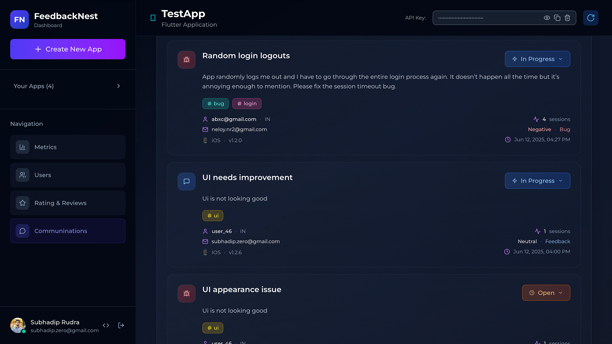

# FlutterFeedbackDialog

Hey r/FlutterDev! 👋

Made a simple Flutter package because I was too lazy to build feedback collection from scratch every time.

What it does:
- Drop-in dialogs for feedback/bug reports/feature requests
- Users can attach screenshots
- Light/dark themes
- Zero backend setup needed

The cool part: All feedback goes to a free AI-powered dashboard that automatically:
- Categorizes feedback with smart tags
- Does sentiment analysis
- Assigns priority levels
- Tracks user analytics

Just add the package, show the dialog, and your feedback is organized automatically.

Perfect for solo devs or small teams who want user feedback without the hassle.

<div align="center">

[](https://pub.dev/packages/flutter_feedback_dialog)
[](https://opensource.org/licenses/MIT)

</div>

## 📸 Screenshots

### Light Theme Dialogs
| Feedback | Bug Report | Feature Request | Contact |
|----------|------------|-----------------|---------|
| <br/> | <br/> | <br/> | <br/> |

### Dark Theme Dialogs
| Feedback | Bug Report | Feature Request | Contact |
|----------|------------|-----------------|---------|
|  |  |  |  |

### FeedbackNest Dashboard Screenshots

#### 📊 User Insights & Analytics Dashboard


#### 🏷️ Individual Feedback with AI Analysis


## 🚀 Quick Integration

### 1. Add Dependencies

```yaml
dependencies:
  flutter_feedback_dialog: any
  feedbacknest_core: any  # For free backend integration
```

### 2. Setup FeedbackNest (Free)

```dart
import 'package:feedbacknest_core/feedbacknest.dart';

void main() {
  runApp(MyApp());
  
  // Initialize FeedbackNest with your free API key
  Feedbacknest.init(
    "your-api-key-from-dashboard",
    userIdentifier: "user@example.com", // Optional
  );
}
```

### 3. Show Dialog & Submit Feedback

```dart
FlutterFeedbackDialog.show(
  context,
  type: CommunicationViewType.feedback,
  theme: CommunicationTheme.light,
  onSubmit: (response) {
    // Send to FeedbackNest for AI analysis
    Feedbacknest.submitCommunication(
      message: response.message,
      type: CommunicationViewType.feedback.name,
      email: response.email,
      files: response.screenshots,
    );
  },
);
```

## 💻 Dialog Types

```dart
// Different dialog types available
FlutterFeedbackDialog.show(context, type: CommunicationViewType.feedback);
FlutterFeedbackDialog.show(context, type: CommunicationViewType.bug);
FlutterFeedbackDialog.show(context, type: CommunicationViewType.featureRequest);
FlutterFeedbackDialog.show(context, type: CommunicationViewType.contact);
```

## 🎨 Customization

```dart
// Customize everything
FlutterFeedbackDialog.show(
  context,
  type: CommunicationViewType.bug,
  theme: CommunicationTheme.dark,
  title: "🐛 Report a Bug",
  subtitle: "Help us squash bugs!",
  buttonText: "Submit Report",
  icon: Icons.bug_report,
  placeholder: "Describe the bug...",
  successMessage: "Thanks! We'll fix it soon.",
  onSubmit: (response) => handleSubmission(response),
);
```

## 🤖 FeedbackNest Free Features

- **🎯 Auto-Generated Titles** - AI creates meaningful titles from messages
- **🏷️ Smart Tags** - Automatically categorizes feedback
- **😊 Sentiment Analysis** - Detects user emotions
- **📊 Priority Detection** - Assigns priority levels based on urgency
- **👥 User Analytics** - Track users, sessions, and growth
- **📈 Trend Analysis** - Identify common issues automatically
- **🔍 Smart Search** - Find feedback with AI-enhanced search
- **⭐ Rating Analytics** - Monitor user satisfaction

## 📄 License

This project is licensed under the MIT License - see the [LICENSE](LICENSE) file for details.

---

<div align="center">

Made with ❤️ by the FeedbackNest team

</div>